= Benutzerhandbuch – Habit Tracker (Expo) 
:toc: 
:toclevels: 3 

== Ziel des Dokuments
Dieses Handbuch unterstützt Nutzer dabei, die **habitree-App** zu starten und erklärt die Bedienung der App.

== Voraussetzungen
* Expo Go App auf dem Handy
* Internetzugang
* Uni-VPN bzw. Verbindung zum HTW-Dresden Netzwerk

== App auf dem Handy starten

Bitte beachten, dass auf dem Handy der eduVPN aktiviert sein muss bzw. Sie sich im Netz der HTW Dresden befinden müssen.

Scanne den angezeigten QR-Code mit der **Expo Go App** auf deinem Smartphone.

image:images/qrcode.png[width=200]

Hinweis: Würde man die App tatsächlich veröffentlichen wäre der QR-Code nicht notwendig, da die App dann über den App Store/Play Store installiert werden könnte.

Der bereitgestellte QR-Code gehört zu einer auf dem HTW-Server laufendem Frontend Docker Container Instanz. In Der Betriebsdokumentation ist angegeben wie man selbst eine Instanz der App starten kann.

Siehe link:../deployment/Betriebsdokumentation.adoc[Betriebsdokumentation] für die detaillierten Schritte zur Installation der Expo Go App.

== Benutzeroberfläche

=== Startseite (Home)

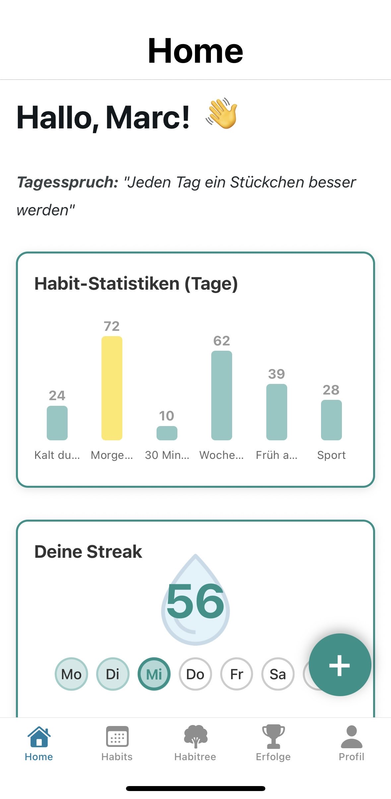 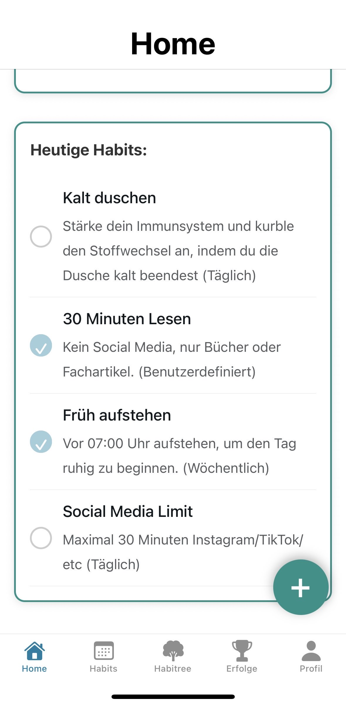

Auf der Startseite siehst du eine Übersicht über deinen aktuellen Fortschritt und deine heutigen Ziele.  

* **Persönliche Begrüßung** – oben wirst du mit deinem Namen begrüßt. 
* **Tagesspruch** – ein motivierender Spruch für den Tag. 
* **Habit Statistiken** – Anzahl der Tage jedes Habits. 
* **Streak-Anzeige** – wie viele Tage du deine Habits in Folge geschafft hast. 
* **Heutige Ziele** – Liste deiner Habits, die heute anstehen.  
* **Plus-Button (+)** zum Hinzufügen neuer Habits

Funktionen auf der Startseite:

- Prüfe deine **heutigen Ziele** und deine **Streak**
- Tippe auf die Check-Box eines Habits, um es abzuhaken.
- Tippe auf den **Plus-Button (+)**, um ein neues Habit zu erstellen.

---

=== Habits-Übersicht

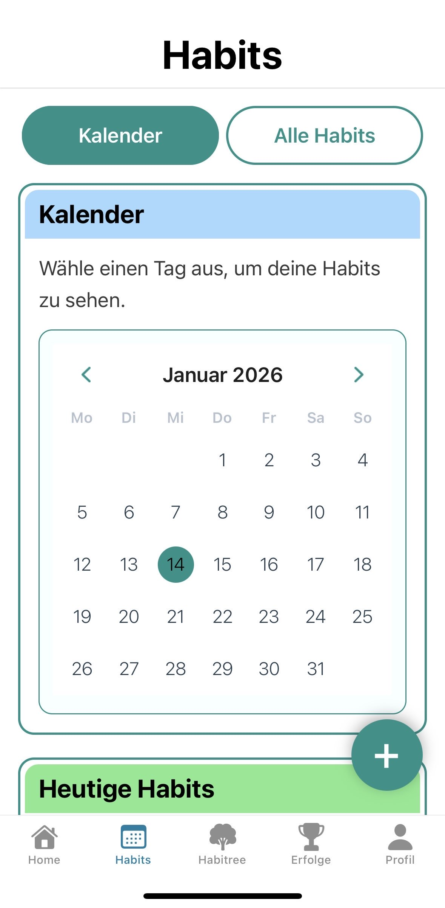 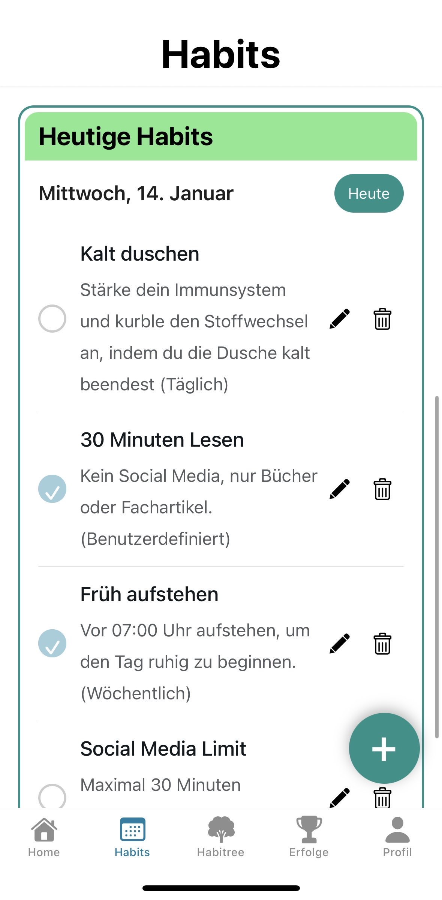 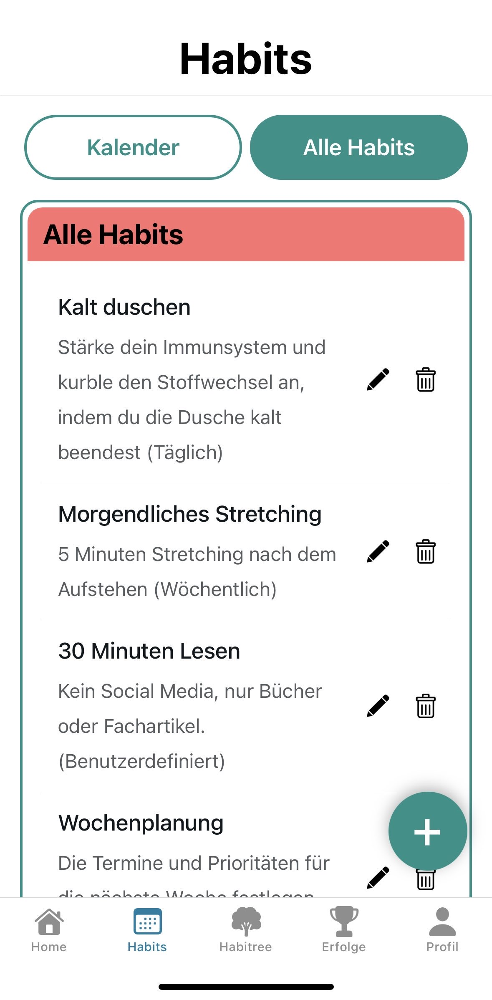 

In der Habits-Ansicht verwaltet der Benutzer seine Gewohnheiten.  
Die Ansicht ist in drei Bereiche unterteilt:

* **Kalender**: Anstehende Habits für den nächsten Tag 
* **Heutige Habits**: Alle geplanten Habits für den aktuellen Tag  
* **Alle Habits**: Vollständige Liste aller angelegten Gewohnheiten  

Funktionen in der Habits-Übersicht: 

- Tippe auf die entsprechenden Symbole eines Habits, um es abzuhaken, zu bearbeiten oder zu löschen. 
- Tippe auf das **Datum** deiner Wahl, um die anstehenden Habits für diesen Tag zu sehen. 
- Nutze den **Plus-Button (+)**, um ein neues Habit anzulegen. 
- Wechsle zwischen den Tabs „Kalender“ und „Alle Habits“, um die Übersicht zu ändern.

---

=== Baum-Ansicht (Fortschritt)

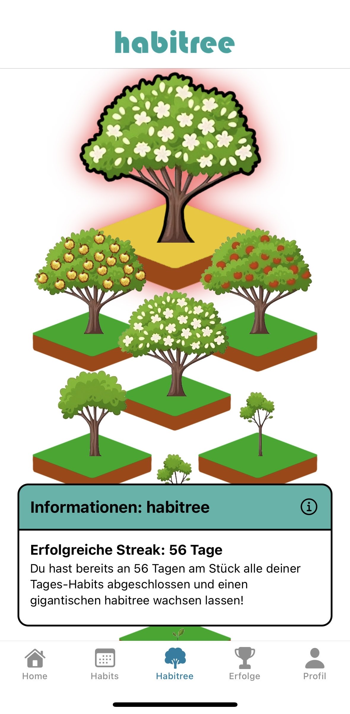 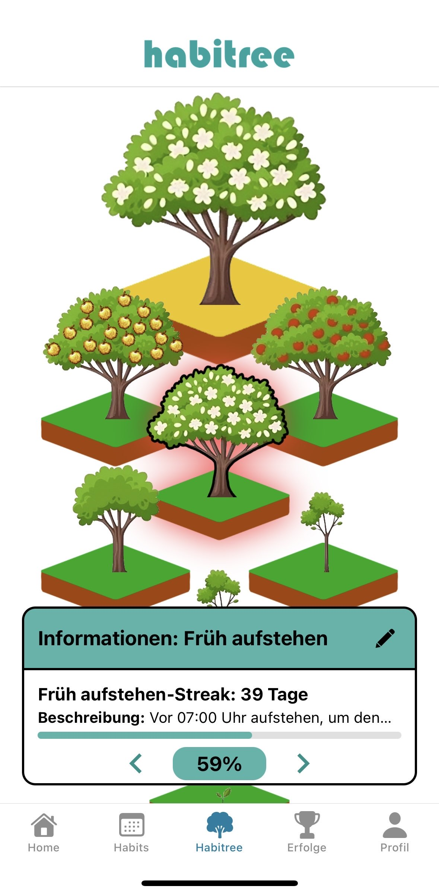

Die Baum-Ansicht zeigt deinen langfristigen Fortschritt in Form eines wachsenden Baumes und noch einen seperaten Baum pro Habit.

* **Baumgröße** – je mehr Habits du erfüllst, desto größer wird dein Baum. 
* **Fortschrittsanzeige** – zeigt deinen aktuellen Fortschritt eines Habits in Prozent. 
* **Streak-Anzeige** – zeigt, wie viele Tage du aktiv warst. 

Der Baum dient als zentrales Motivations- und Belohnungselement der App.

---

=== Erfolge

 

In der Erfolge-Ansicht findest du alle Abzeichen, die du durch das Erreichen bestimmter Meilensteine freigeschaltet hast.

* **Abzeichenübersicht** – zeigt alle erreichten und noch gesperrten Abzeichen. 
* **Detailansicht** – tippe ein Abzeichen an, um zu sehen, wie du es verdient hast.

Die Inventar-Ansicht dient der Gamification und zusätzlichen Motivation, regelmäßig Habits zu erfüllen.

---

=== Profil / Einstellungen

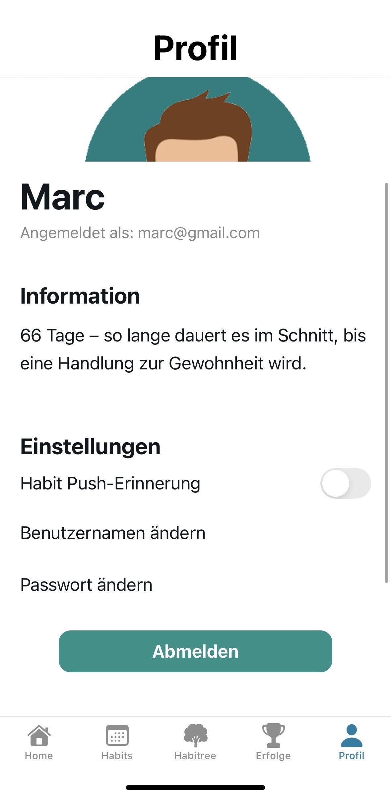

In der Profil-Ansicht kann der Benutzer persönliche Daten und App-Einstellungen anpassen:

* **Benutzername**, **Profilbild** und **E-Mail** angezeigt bekommen
* **Information**, warum es ein Ziel von 66 Tagen gibt
* **Benachrichtigungen** aktivieren/deaktivieren 
* **Account verwalten**, z. B. Passwort und Benutzername ändern  oder Abmelden  

---

=== Navigation

Die untere Navigationsleiste ist in allen Ansichten sichtbar und ermöglicht den schnellen Zugriff auf:

* Home  
* Habits  
* Habitree 
* Erfolge  
* Profil  

== Hauptaufgaben / Features

=== Neue Gewohnheit anlegen

==== Ein vordefiniertes Ziel wählen

Mit vordefinierten Zielen kannst du schnell und einfach ein neues Habit erstellen.

image:images/habit1n.jpg[width=200] 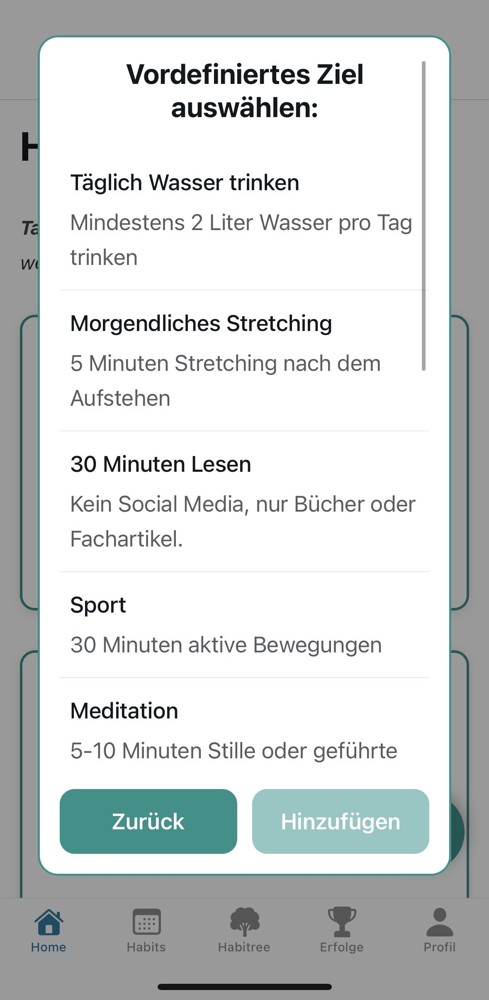 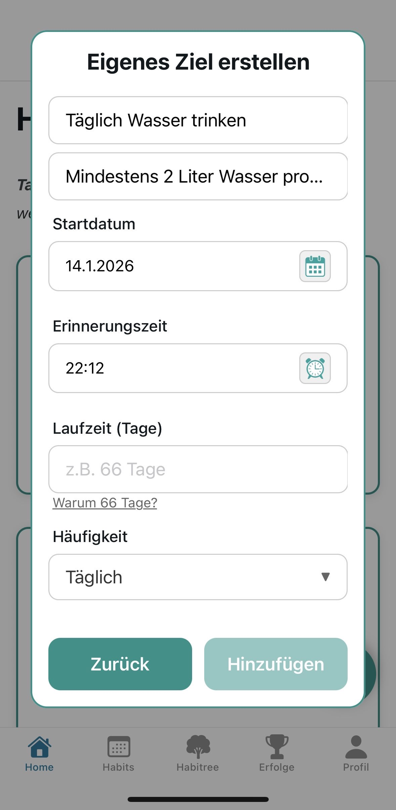

So legst du ein vordefiniertes Habit an: 

- Tippe auf den **Plus-Button (+)**, um ein neues Habit zu erstellen.
- Tippe auf **vordefiniertes Ziel wählen**.
- Wähle ein **vordefiniertes Ziel** aus der Liste. 
- Lege **Häufigkeit** fest.
- Passe bei Bedarf **Name**, **Häufigkeit**, **Uhrzeit** und **Startdatum** an
- Bestätige mit **Hinzufügen**
- Das Habit erscheint nun in deinen **heutigen** oder **kommenden Habits**.

==== Ein eigenes Ziel wählen
Wenn du ein individuelles Ziel hast, kannst du ein eigenes Habit erstellen.

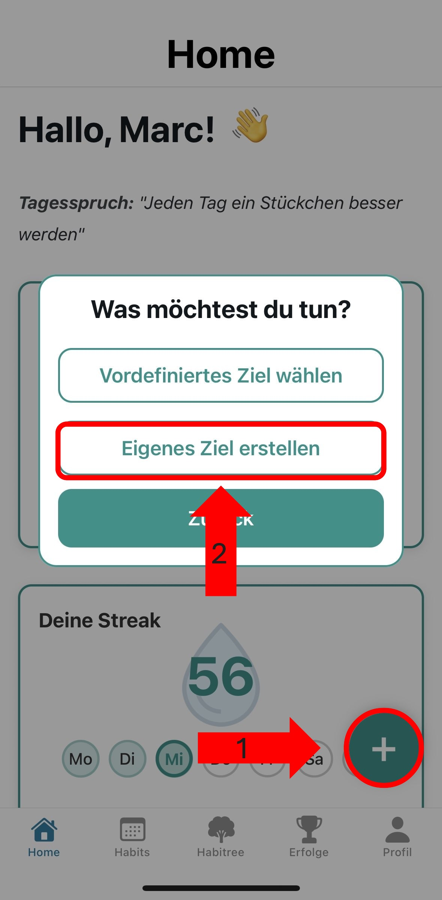 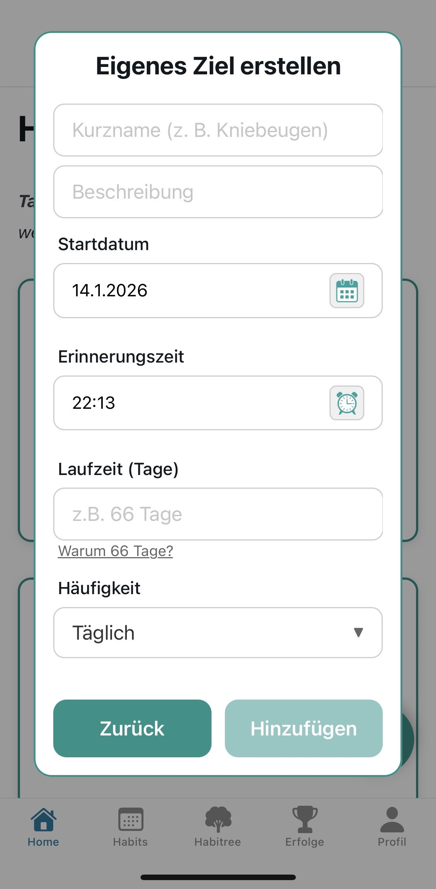

So legst du ein eigenes Habit an:

- Tippe auf den **Plus-Button (+)**, um ein neues Habit zu erstellen.
- Tippe auf **eigenes Ziel erstellen**.
- Gib einen **Namen** für dein Habit ein. 
- Lege **Laufzeit** und **Beschreibung** fest.
- Passe bei Bedarf **Häufigkeit**, **Uhrzeit** und **Startdatum** an.
- Bestätige mit **Hinzufügen**
- Das Habit erscheint nun in deinen **heutigen** oder **kommenden Habits**.

=== Gewohnheit abhaken

Das Abhaken eines Habits ist der wichtigste Schritt, um deinen Fortschritt zu dokumentieren.

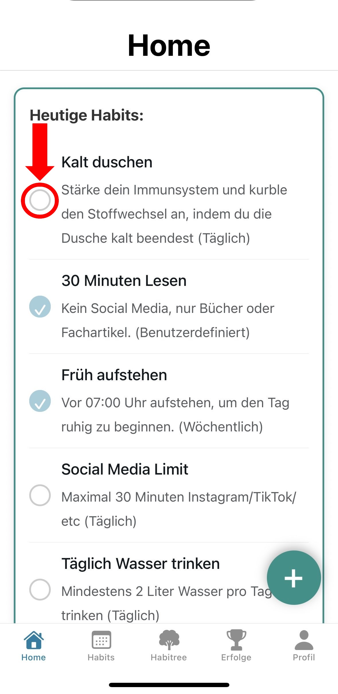 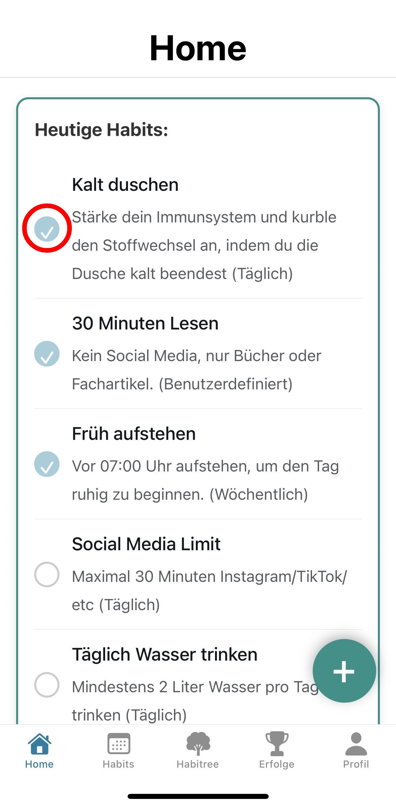

==== So hakst du ein Habit ab (1. Möglichkeit): 

- Scrolle bei Home runter zu **heutige Habits**. 
- Tippe auf die **Checkbox** des erledigten Habits.
- Dein **Baum** und deine **Streak** aktualisieren sich automatisch.

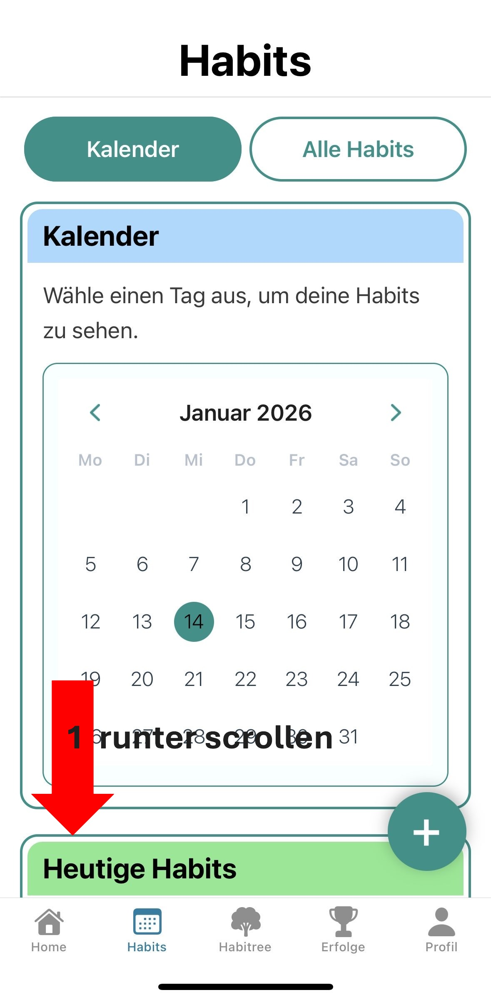 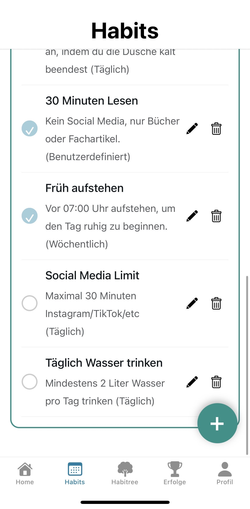

==== So hakst du ein Habit ab (2. Möglichkeit): 

- Navigiere zu der Seite **Habits**. 
- Scrolle runter zu **heutige Habits**.
- Tippe auf die **Checkbox** des erledigten Habits.
- Dein **Baum** und deine **Streak** aktualisieren sich automatisch.

=== Gewohnheit bearbeiten / löschen

Du kannst jedes Habit jederzeit anpassen oder entfernen.

 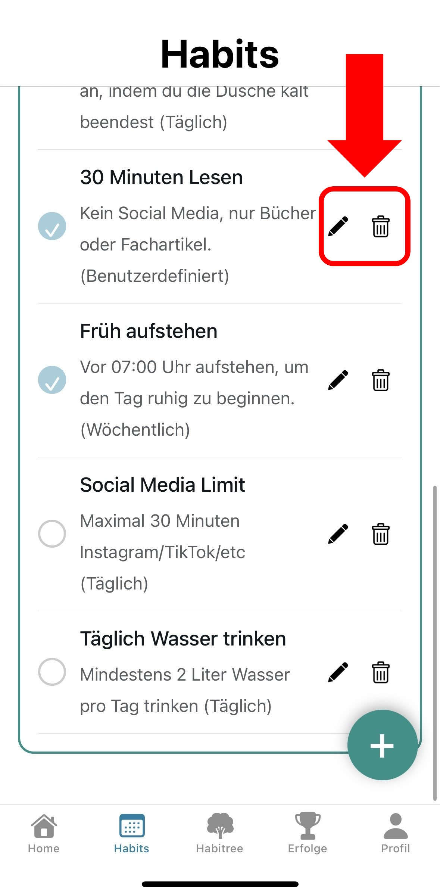 

==== So bearbeitest oder löschst du ein Habit (1. Möglichkeit):

- Navigiere zu der Seite **Habits**.
- Scrolle runter zu **heutige Habits**.
- Tippe auf das **Stift Symbol** um das Habit zu bearbeiten.
- Tippe auf das **Papierkorb Symbol** um das Habit zu löschen.

 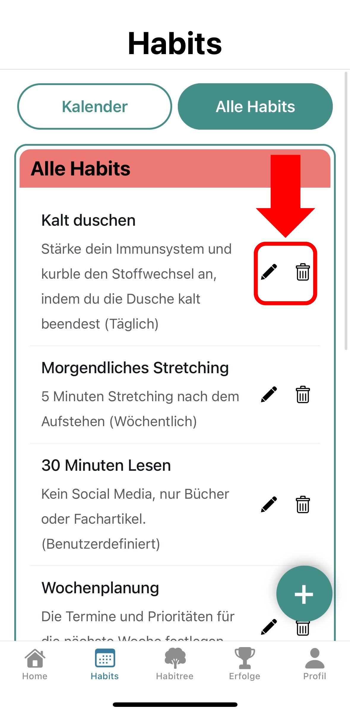

==== So bearbeitest oder löschst du ein Habit (2. Möglichkeit):

- Navigiere zu der Seite **Habits**.
- Wechsel zu **Alle Habits**.
- Tippe auf das **Stift Symbol** um das Habit zu bearbeiten.
- Tippe auf das **Papierkorb Symbol** um das Habit zu löschen.

image:images/kal4.jpg[width=200] 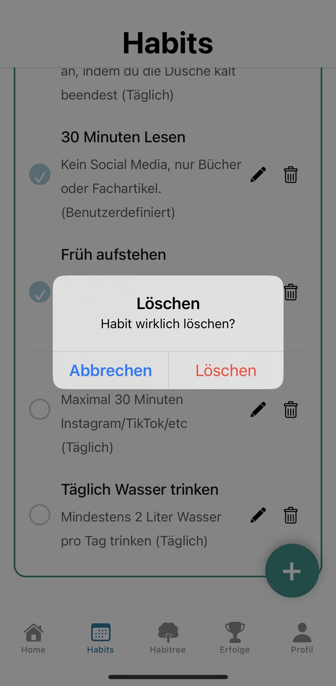

- Jetzt kann das Habit bearbeitet oder das Löschen bestätigt werden.

=== Baum anzeigen und wachsen lassen

Der Baum zeigt deinen langfristigen Fortschritt. Je mehr Habits du erfüllst, desto größer wird er.

image:images/tree2.jpg[width=200]

- Navigiere zu der Seite **Habitree**.
- Sieh dir deinen aktuellen Fortschritt aller Habits an.

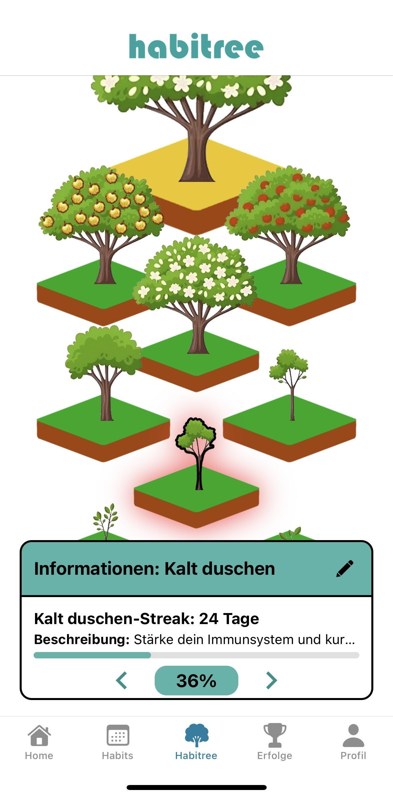  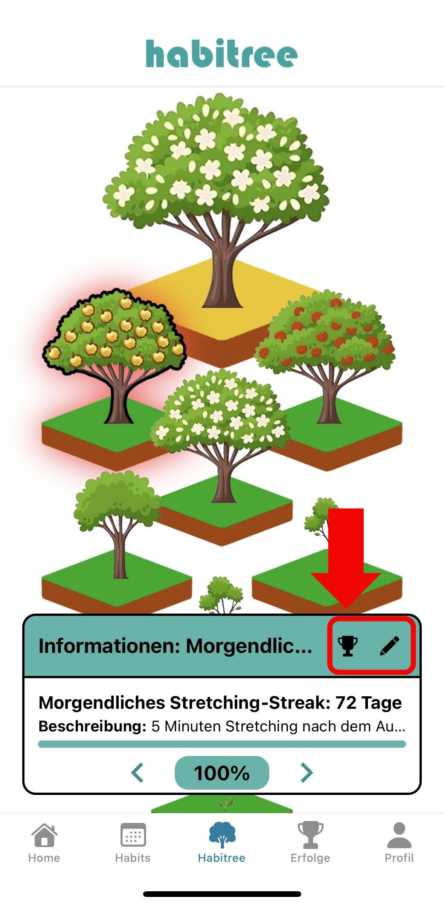

- Klicke einen Baum um sein Habit und dessen Streak anzeigen zu lassen.
- Je mehr Tage erfolgreich abgeschlossen wurden, desto mehr wächst der Baum.
- Klicke auf das Pokal-Symbol um den Baum zu ernten, nur möglcih wenn das Streak-Ziel erreicht wurde. 
- Beim Ernten erhält man einen Erfolg.

=== Abzeichen verdienen und anzeigen lassen

Abzeichen motivieren dich, dranzubleiben und neue Ziele zu erreichen.

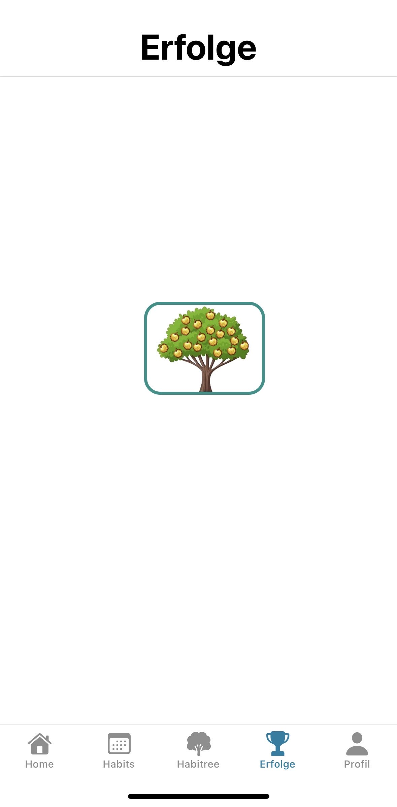 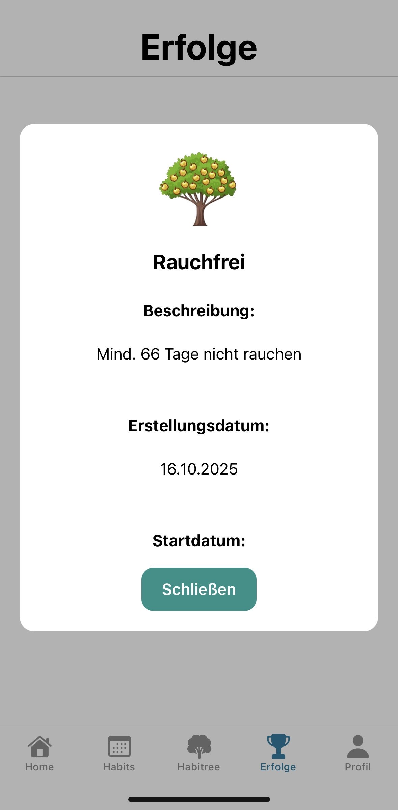

So verdienst du Abzeichen:

- Erfülle regelmäßig deine Habits. 
- Erreiche bestimmte Meilensteine (z. B. mehrere Tage in Folge).
- Ernte deine Bäume.
- Öffne die Ansicht **Erfolge**, um neue Abzeichen zu sehen 
- Tippe ein Abzeichen an, um Details zu sehen.

=== Anmelden/ Abmelden/ Registrieren

Beim ersten Start der App oder nach dem Abmelden meldest du dich (erneut) an oder erstellst einen neuen Account.

==== Anmelden:

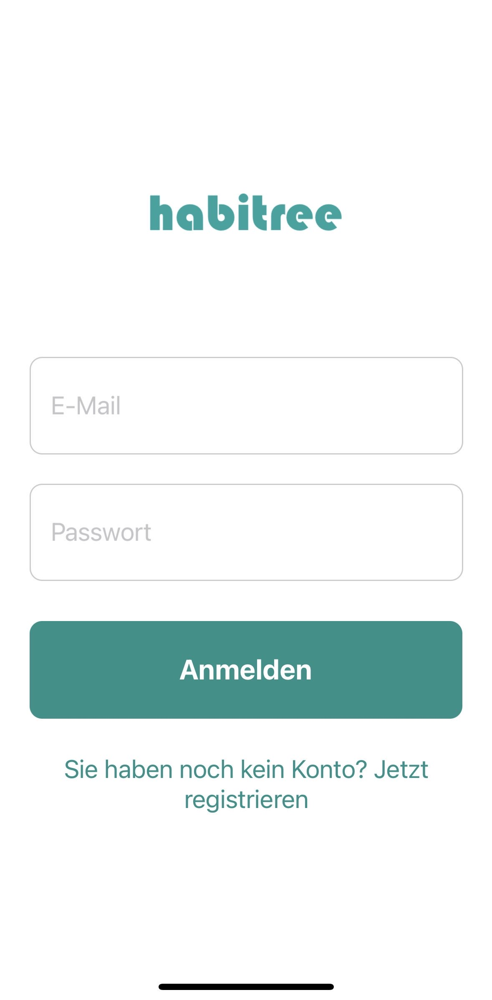 

- Gebe deinen Benutzernamen und Passwort ein und klicke auf **Anmelden**.

==== Registrieren:

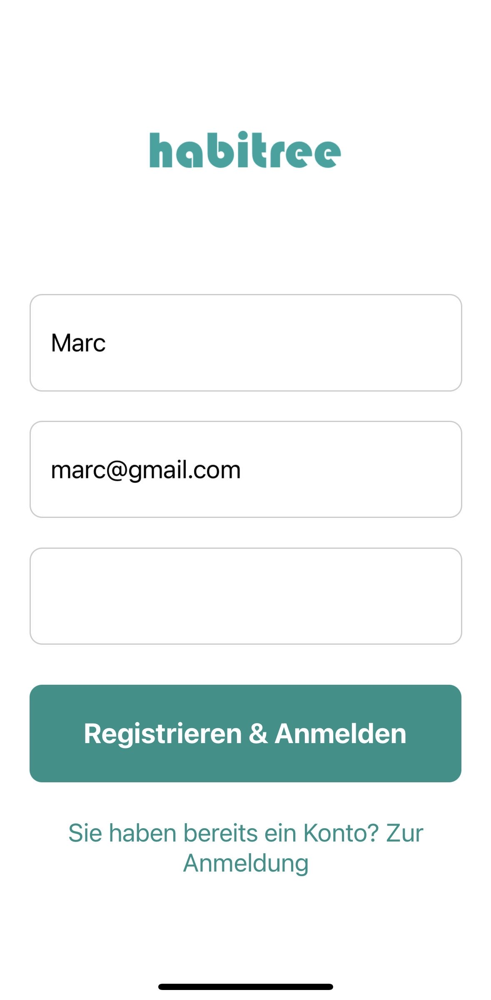

- Auf **Jetzt registrieren** klicken.
- Neuen Benutzernamen, Email und Passwort eingeben.
- Auf **Registrieren & Anmelden** klicken.

==== Abmelden:

- Navigiere zu der Seite **Profil**.
- Auf *Abmelden** klicken.

== FAQ / Häufige Probleme

==== Warum funktioniert der QR-Code nicht?
  
  - Stelle sicher, dass Expo läuft und die VPN an ist damit dein Handy im gleichen Netzwerk ist.

==== Meine Habits werden nicht geladen / Ich kann mich nicht einloggen
 
  - Prüfe, ob du angemeldet bist.
  - Stelle sicher, dass du Zugriff auf das HTW‑Netzwerk hast und die VPN aktiv ist.
  - Falls weiterhin Probleme auftreten: App neu starten oder Internetverbindung prüfen.

==== Der Baum wächst nicht?
  
  - Nur wenn du deine Habits regelmäßig abhaken kannst, steigt der Fortschritt.
  - Wenn du mehrere Tage auslässt, wird die Streak zurückgesetzt.
  - Vergesse also nicht deine Habits zu erledigen.

==== Warum 66 Tage?

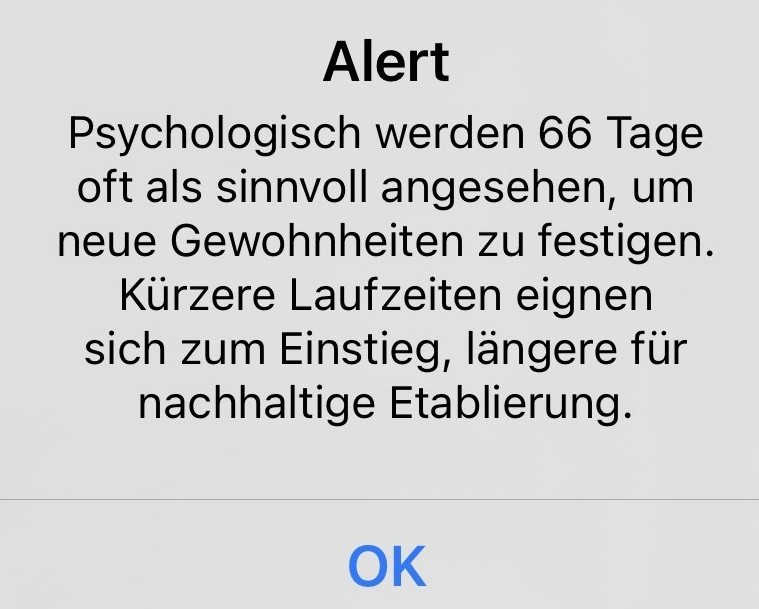

==== Wo sehe ich meine aktuelle Streak?

 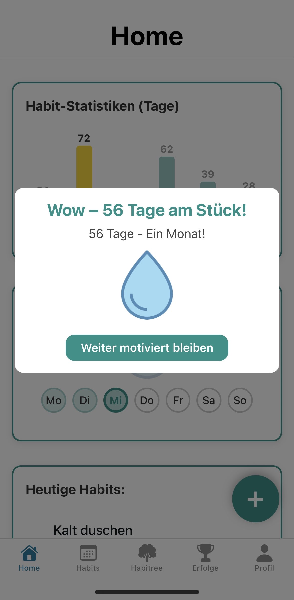
 
  - Im Home Menü unter dem Menüpunkt **Streak**.

==== Wo sehe ich meine aktuelle Streak eines Habits?

 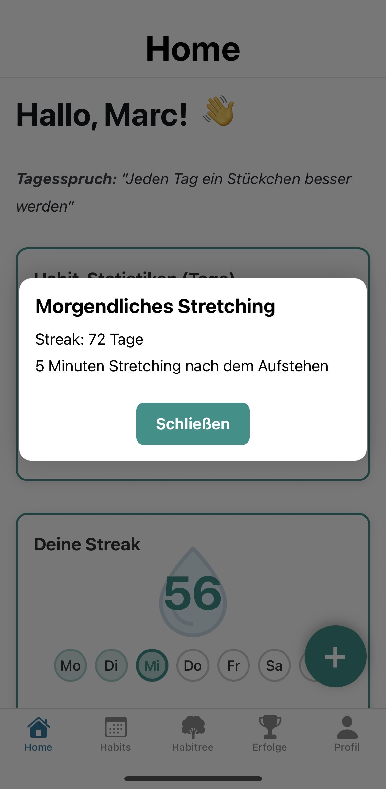

  - Im Home Menü unter dem Menüpunkt **Habit Statistiken (Tage)**.
  - Klicke auf das gewünschte Habit um genauere Informationen zu dem Habit und dessen Streak zu bekommen.

==== Was passiert nachdem ich mein Habit abgeschlossen habe?

  

  - Du kannst entscheiden ob du weiter dran bleiben möchtest oder den Baum ernten willst.
  - Wenn du weiter dran bleibst, wächst der Baum weiter und deine Streak erhöht sich.
  - Wenn du das Streak‑Ziel erreicht hast, kannst du aber auch den Baum ernten und erhältst ein Abzeichen.
  - Hierfür einfach auf das **Pokal Symbol** unten bei den abgeschlossenen Baum tippen.

==== Kann ich ein Habit nachträglich bearbeiten?

- Ja, du kannst Name, Beschreibung oder Häufigkeit jederzeit anpassen. Dein bisheriger Fortschritt bleibt dabei erhalten.

==== Kann ich ein Habit löschen?

- Ja, aber Achtung: Beim Löschen gehen Streak und Baum verloren. 

==== Was passiert, wenn ich einen Tag vergesse?

- Dann wird der Streak zurückgesetzt. Das ist nicht schlimm – wichtig ist, dass du wieder einsteigst.

== Tipps & Tricks

**Fang klein an**

Du musst nicht direkt große Ziele setzen. 
Ein paar Minuten pro Tag reichen völlig. 

**Mach es dir leicht**

Verbinde neue Gewohnheiten mit Dingen, die du sowieso tust, 
zum Beispiel: „Nach dem Zähneputzen trinke ich ein Glas Wasser“. 

**Fang klein an**

Du musst nicht direkt große Ziele setzen. 
Ein paar Minuten pro Tag reichen völlig.

**Nutze die Streaks als kleinen Motivationsschub**

Es fühlt sich gut an, wenn die Kette länger wird.  
Versuche, sie nicht zu unterbrechen – aber sei nicht zu streng mit dir.

**Plane realistisch**

Zu viele Habits auf einmal überfordern. 
Starte lieber mit ein bis zwei Gewohnheiten und steigere dich später.

**Belohne dich bewusst**

Wenn du dein Streak-Ziel erreichst, gönn dir etwas Schönes.  
Das verstärkt den positiven Effekt und macht Spaß.

**Der Baum ist dein Fortschrittsbarometer**

Der wachsende Baum zeigt dir, dass du dranbleibst.  
Das Ernten fühlt sich wie ein kleines Level-Up an.

**Rückschläge gehören dazu**

Ein verpasster Tag ist kein Weltuntergang. 
Wichtig ist, dass du wieder einsteigst und weitermachst.

**Passe deine Habits an dein Leben an**

Wenn etwas nicht funktioniert, ändere es. 
Ein Habit soll dich unterstützen, nicht stressen.

**Nutze feste Zeiten**

Gewohnheiten bleiben leichter hängen, wenn sie einen festen Platz im Alltag haben. 
Ein kurzer Reminder kann zusätzlich helfen.

**Hab Spaß dabei**

Es geht nicht um Perfektion, sondern um Entwicklung. 
Jeder kleine Schritt zählt.

== 12. Abschluss / Weiterführende Links
GitHub Repository: https://github.com/laurenzzzzzz/htwd-se1-habitree

