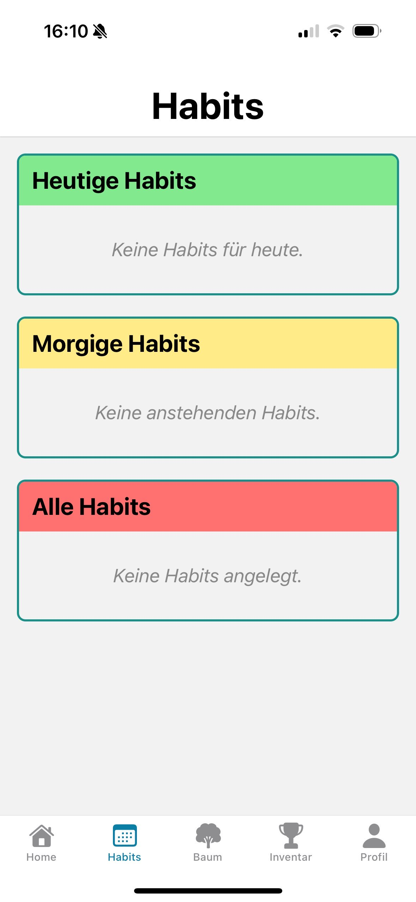

= Benutzerhandbuch – Habit Tracker (Expo)

== 1. Ziel des Dokuments
Dieses Handbuch unterstützt Nutzer dabei, die **Habit Tracker App** zu starten und erklärt die Bedienung der App.

== 2. Voraussetzungen
* Expo Go App auf dem Handy
* Internetzugang
* Uni-VPN bzw. Verbindung zum HTW-Dresden Netzwerk

== 3. App auf dem Handy starten

Bitte beachten das auf dem Handy der eduVPN aktiviert sein muss bzw. im Netz der HTW-Dresden sein muss.

Scanne den angezeigten QR-Code mit der **Expo Go App** auf deinem Smartphone.

Hinweis: Würde man die App tatsächlich veröffentlichen wäre der QR-Code nicht notwendig, da die App dann über den App Store/Play Store installiert werden könnte.

== 4. Benutzeroberfläche

=== Startseite (Home)

image::images/Startseite.jpg[Startseite der App, width=300]

Auf der Startseite wird der Benutzer persönlich begrüßt (z. B. *„Hallo, Nutzer!“*).  
Zusätzlich werden folgende Informationen angezeigt:

* **Tagesspruch**, der zur Motivation beiträgt
* **Statistiken** zu allen oder einzelnen Habits
* **Liniendiagramm**, welches den Fortschritt der Habits über mehrere Tage darstellt
* **Aktuelle Streak**, welche anzeigt, wie viele Tage in Folge Habits erfüllt wurden
* **Wochentage**, welche anzeigen an welchen Tagen die Streak erfüllt wurde
* **Heutige Ziele:** für die Habits
* **Plus-Button (+)** zum Hinzufügen neuer Habits

---

=== Habits-Übersicht

In der Habits-Ansicht verwaltet der Benutzer seine Gewohnheiten.  
Die Ansicht ist in drei Bereiche unterteilt:

* **Heutige Habits**: Alle geplanten Habits für den aktuellen Tag  
* **Morgige Habits**: Anstehende Habits für den nächsten Tag  
* **Alle Habits**: Vollständige Liste aller angelegten Gewohnheiten  

---

=== Baum-Ansicht (Fortschritt)

image::images/Baum.jpg[Baum Fortschritt, width=300]

Die Baum-Ansicht visualisiert den Fortschritt des Benutzers:

* Der **Baum wächst**, je mehr Habits erfolgreich abgeschlossen werden  
* **Baum-Wachstum in Prozent**   
* **Aktuelle Stufe**  
* **Streak-Anzeige**, welche zeigt, wie viele Tage der Benutzer aktiv war  

Der Baum dient als zentrales Motivations- und Belohnungselement der App.

---

=== Inventar / Abzeichen

image::images/Inventar.jpg[Inventar / Abzeichen Übersicht, width=300]

In der Inventar-Ansicht sieht der Benutzer alle gesammelten Abzeichen und Belohnungen:

* **Abzeichen** für erreichte Meilensteine  
* Abzeichen antippen, um Details und Voraussetzungen zu sehen  

Die Inventar-Ansicht dient der Gamification und zusätzlichen Motivation, regelmäßig Habits zu erfüllen.

---

=== Profil / Einstellungen

image::images/Profil.jpg[Profil-Ansicht und Einstellungen, width=300]

In der Profil-Ansicht kann der Benutzer persönliche Daten und App-Einstellungen anpassen:

* **Benutzername**, **Profilbild** und **E-Mail** angezeigt bekommen
* **Information**, warum es ein Ziel von 66 Tagen gibt
* **Freunde** finden und verbinden 
* **App-Einstellungen**, z. B. Benachrichtigungen, Anzeige (hell/dunkel)   
* **Account verwalten**, z. B. Passwort und Benutzername ändern  oder Abmelden  

Die Profil-Ansicht ermöglicht es, die App an persönliche Vorlieben anzupassen und einen Überblick über die eigene Aktivität zu behalten.

---

=== Navigation

Die untere Navigationsleiste ist in allen Ansichten sichtbar und ermöglicht den schnellen Zugriff auf:

* Home  
* Habits  
* Baum  
* Inventar  
* Profil  

== 5. Hauptaufgaben / Features
=== 5.1 Neue Gewohnheit anlegen

=== 5.2 Gewohnheit abhaken

=== 5.3 Gewohnheit bearbeiten / löschen

=== 5.4 Alle Gewohnheiten anzeigen

=== 5.5 Baum anzeigen und wachsen lassen

=== 5.6 Abzeichen verdienen und anzeigen lassen

=== 5.7 Anmelden/ Abmelden/ Registrieren

== 7. FAQ / Häufige Probleme
//- **Warum sehe ich den QR-Code nicht?** - Stelle sicher, dass Expo läuft und die VPN an ist damit dein Handy im gleichen Netzwerk ist.

- **Meine Habits werden nicht geladen / Ich kann mich nicht einloggen** - Prüfe, ob du dich mit deinem Account eingeloggt hast und du Zugriff zum HTW-Netzwerk hast.

- **Der Baum wächst nicht?** - Nur wenn du deine Habits regelmäßig abhaken kannst, steigt der Fortschritt.

== 11. Tipps & Tricks
- Starte mit kleinen Gewohnheiten – lieber 5 Minuten lesen als gleich ein ganzes Buch.

- Nutze die Streak-Anzeige als Motivation: schon 3 Tage geschafft, jetzt nicht abbrechen!

== 12. Abschluss / Weiterführende Links
GitHub Repository: https://github.com/laurenzzzzzz/htwd-se1-habitree

