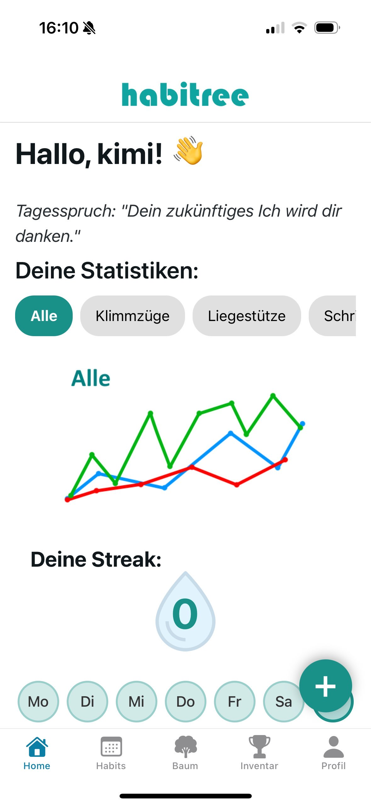
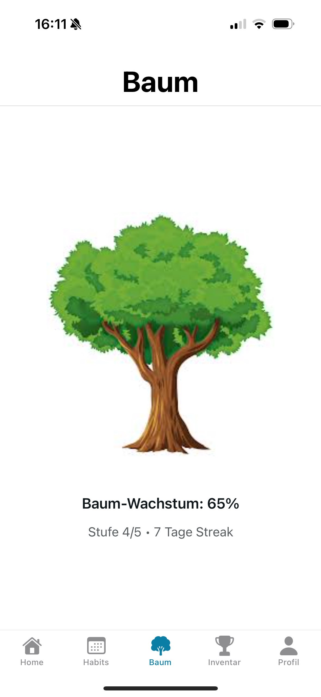
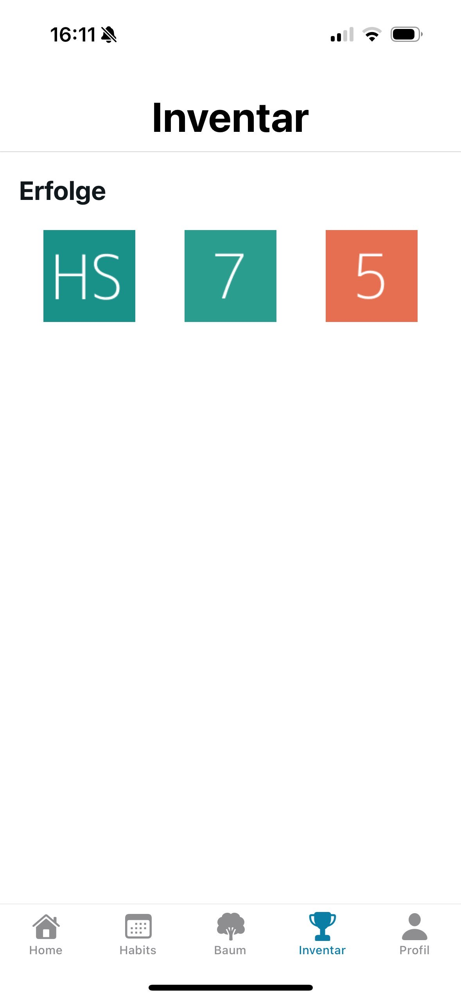
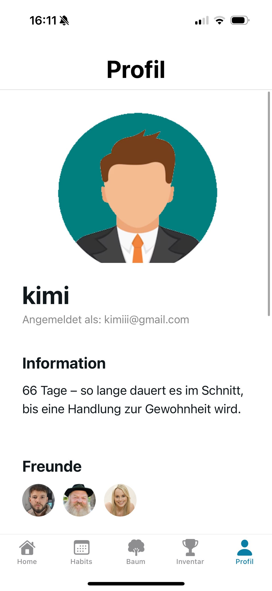

= Benutzerhandbuch – Habit Tracker (Expo)

== 1. Ziel des Dokuments
Dieses Handbuch unterstützt Nutzer dabei, die **Habit Tracker App** zu starten, Gewohnheiten anzulegen und Fortschritte zu verfolgen.

== 2. Voraussetzungen
* Windows-PC oder Mac mit **VS Code**
* Expo Go auf dem Handy
* Node.js installiert
* `npx expo` verfügbar
* Internetzugang
* (Optional) Uni-VPN

== 3. Zugriff auf das System / Projekt
* GitHub Repository: https://github.com/laurenzzzzzz/htwd-se1-habitree/tree/main
* Hinweis: Um lokal zu arbeiten, muss das Projekt aus GitHub geklont werden.

== 4. Projekt lokal öffnen
1. GitHub Repository klonen:
```bash
git clone https://github.com/laurenzzzzzz/htwd-se1-habitree.git
```
2. **VS Code öffnen**  
3. Menü: **Datei → Ordner öffnen**  
4. Ordner auswählen:
```bash
htwd-se1-habitree/src/habitree
```

== 5. Projekt aktualisieren
* Git Pull ausführen, um neueste Änderungen zu holen:
```bash
git pull
```
* Abhängigkeiten installieren:
```bash
npm install
```

== 6. Expo starten

```bash
npx expo start
```

* QR-Code im Browser-UI scannen, Handy verbindet sich über Internet
* Android: a
* iOS: i

== 7. Benutzeroberfläche

=== Startseite (Home)



Auf der Startseite wird der Benutzer persönlich begrüßt (z. B. *„Hallo, Nutzer!“*).  
Zusätzlich werden folgende Informationen angezeigt:

* **Tagesspruch**, der zur Motivation beiträgt
* **Statistiken** zu allen oder einzelnen Habits
* **Liniendiagramm**, welches den Fortschritt der Habits über mehrere Tage darstellt
* **Aktuelle Streak**, welche anzeigt, wie viele Tage in Folge Habits erfüllt wurden
* **Wochentage**, welche anzeigen an welchen Tagen die Streak erfüllt wurde
* **Heutige Ziele:** für die Habits
* **Plus-Button (+)** zum Hinzufügen neuer Habits

---

=== Habits-Übersicht

image::images/Habits.jpg[Habits Übersicht, width=300]

In der Habits-Ansicht verwaltet der Benutzer seine Gewohnheiten.  
Die Ansicht ist in drei Bereiche unterteilt:

* **Heutige Habits**: Alle geplanten Habits für den aktuellen Tag  
* **Morgige Habits**: Anstehende Habits für den nächsten Tag  
* **Alle Habits**: Vollständige Liste aller angelegten Gewohnheiten  

---

=== Baum-Ansicht (Fortschritt)



Die Baum-Ansicht visualisiert den Fortschritt des Benutzers:

* Der **Baum wächst**, je mehr Habits erfolgreich abgeschlossen werden  
* **Baum-Wachstum in Prozent**   
* **Aktuelle Stufe**  
* **Streak-Anzeige**, welche zeigt, wie viele Tage der Benutzer aktiv war  

Der Baum dient als zentrales Motivations- und Belohnungselement der App.

---

=== Inventar / Abzeichen



In der Inventar-Ansicht sieht der Benutzer alle gesammelten Abzeichen und Belohnungen:

* **Abzeichen** für erreichte Meilensteine  
* Abzeichen antippen, um Details und Voraussetzungen zu sehen  

Die Inventar-Ansicht dient der Gamification und zusätzlichen Motivation, regelmäßig Habits zu erfüllen.

---

=== Profil / Einstellungen



In der Profil-Ansicht kann der Benutzer persönliche Daten und App-Einstellungen anpassen:

* **Benutzername**, **Profilbild** und **E-Mail** angezeigt bekommen
* **Information**, warum es ein Ziel von 66 Tagen gibt
* **Freunde** finden und verbinden 
* **App-Einstellungen**, z. B. Benachrichtigungen, Anzeige (hell/dunkel)   
* **Account verwalten**, z. B. Passwort und Benutzername ändern  oder Abmelden  

Die Profil-Ansicht ermöglicht es, die App an persönliche Vorlieben anzupassen und einen Überblick über die eigene Aktivität zu behalten.

---

=== Navigation

Die untere Navigationsleiste ist in allen Ansichten sichtbar und ermöglicht den schnellen Zugriff auf:

* Home  
* Habits  
* Baum  
* Inventar  
* Profil  

== 8. Hauptaufgaben / Features
=== 8.1 Neue Gewohnheit anlegen

=== 8.2 Gewohnheit abhaken


=== 8.3 Gewohnheit bearbeiten / löschen


== 9. Selten genutzte Funktionen


== 10. FAQ / Häufige Probleme


== 11. Tipps & Tricks


== 12. Abschluss / Weiterführende Links
