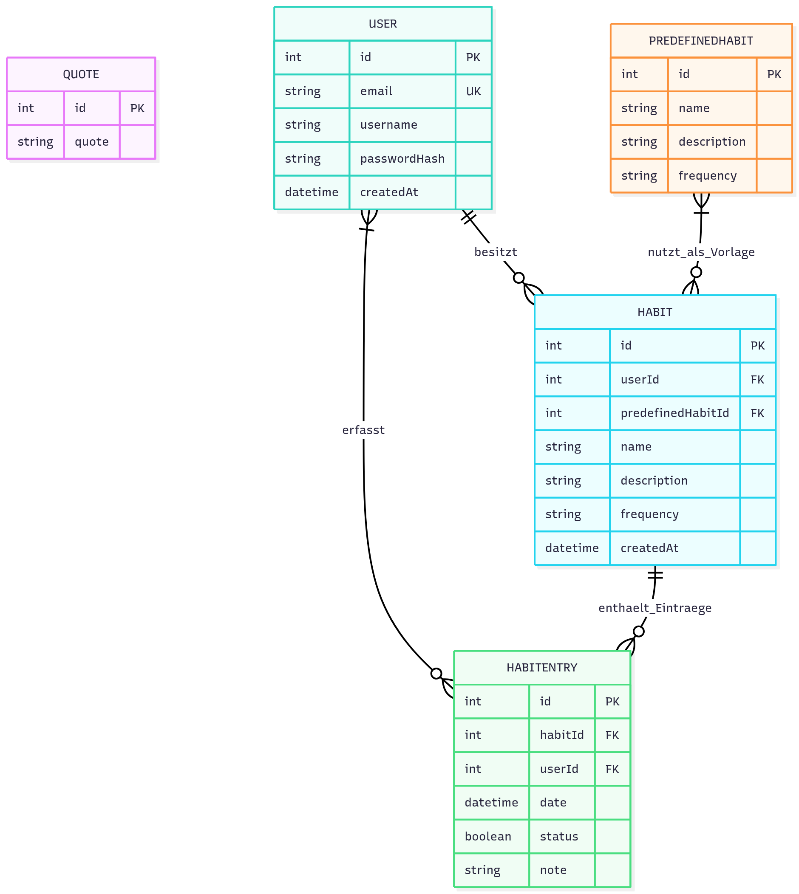

= Design: {project-name}
Laurenz Born <laurenz.born@stud.htw-dresden.de>; Alexander Chlebowski <alexander.chlebowski@stud.htw-dresden.de>; Leonhard Hermann <leonhard.hermann@stud.htw-dresden.de>; Johann Schmidt <johann.schmidt@stud.htw-dresden.de>; Kimi Jerke <kimi.jerke@stud.htw-dresden.de>; Jannes Lehmann <s86317@htw-dresden.de>
{localdatetime}
include::../_includes/default-attributes.inc.adoc[]

== Zweck
Dieses Dokument beschreibt wesentliche Entwurfsentscheidungen auf Ebene der Komponenten und Module. Diese dienen als Vorgabe für die Implementierung und erleichtern das Systemverständnis.

//kein Plan ob das hier rein muss sowas

== Designentscheidungen nach Komponenten
=== Authentifizierung & Sessions
* **Automatisches Wiederanmelden:** Beim Start prüft der AuthProvider, ob ein gespeichertes Token im SecureStore liegt. Ist es noch gültig, bleibt die Sitzung aktiv, anderenfalls erscheint direkt der Login-Screen.
* **Token erneuern:** Es gibt nur ein Token. Läuft er ab, meldet sich der Nutzer erneut an. Damit bleibt die Backend-Logik überschaubar und wir müssen keine weiteren Token-Typen pflegen.

=== Tagesplan & Habitlisten
* **Optimistic Updates:** `useHabitsController` setzt den UI-Status sofort auf „erledigt“, bevor `POST /habits/{id}/entries` abgeschlossen ist. Schlägt der Request fehl, wird der lokale Zustand zurückgesetzt. Somit sieht der Nutzer direkt dass ein Habit erledigt ist, statt auf eine Server-Antwort zu warten. Dies erhöht die wahrgenommene Performance der App.
* **Sortierung im Client:** Die Habits werden clientseitig nach Startzeit sortiert, damit verschiedene Listen (heute, Archiv, Filter) ohne zusätzliche Backend-Routen möglich sind und UI-Anpassungen ohne Backend-Deployment getestet werden können.

=== Offline-Stand
* **Gespeicherte Tokens:** Derzeit schreibt nur `SecureStoreAuthRepository` die Authentifizierungsdaten verschlüsselt auf das Gerät. Habit-Listen werden ausschließlich live vom Server geladen; Caching ist als zukünftige Erweiterung markiert.

=== UI-Konzepte
* **Controller-Hooks:** Jeder Screen nutzt eigene Hooks wie `useHabitsController`. Diese halten ihren Zustand selbst, daher brauchen wir keinen globalen Store bzw. eine zentrale Datensammelstelle, auf die jede Komponente zugreifen müsste. Änderungen passieren direkt im jeweiligen Screen und bleiben dadurch überschaubar.

* **Theming:** ThemedView/ThemedText nutzen presentation/styles/colors.ts, sodass alle Screens dieselben Farbwerte verwenden, UI-Änderungen (z. B. neue Palette oder Dark Mode) nur an einer Stelle angepasst werden müssen und keine Komponente eigene Farben pflegt.

== Ausgewählte Sichten
=== Sequenzdiagramm Registrierung
//image::./images/Sequenzdiagramm_Registrierung.png[]
[mermaid]
....
include::../development/plantuml/sequenzdiagramme.md[lines=66..104]
....

=== Sequenzdiagramm Login
// image::./images/Sequenzdiagramm_Anmeldung.png[]
[mermaid]
....
include::../development/plantuml/sequenzdiagramme.md[lines=19..55]
....

== Schnittstellen
// Dokumentation oder Verweise auf Schnittstellen, z.B REST-APIs

* **REST-API (OpenAPI 3.0):** Die Spezifikation liegt in `docs/architecture/openapi.yaml`. Für eine interaktive Ansicht kann z. B. Redoc gestartet werden (`redoc-cli serve docs/architecture/openapi.yaml`) oder Swagger UI mit diesem Pfad verwendet werden.

[cols="1,1,2,2",options="header"]
|===
| Endpoint | Methode | Anfrage (wichtige Felder) | Antwort / Hinweise
| `/auth/register` | POST | `{ email, password, username }` | 201 + Token + Nutzerdaten
| `/auth/login` | POST | `{ email, password }` | 200 + Token + Nutzerdaten
| `/auth/password` | PUT | `{ oldPassword, newPassword }` | 200 + Erfolg (Passwort geändert)
| `/habits` | GET | Header `Authorization: Bearer <Token>` | Liste aller aktiven (nicht geernteten) Habits
| `/habits` | POST | `{ name, description, frequency, startDate, time, ... }` | 201 + neu angelegtes Habit
| `/habits/{id}` | PUT | Felder wie POST | 200 + aktualisiertes Habit
| `/habits/{id}` | DELETE | — | 200 + Erfolg
| `/habits/{id}/toggle` | PUT | `{ date }` | 200 + Habit-Status für Datum umgeschaltet
| `/habits/today` | GET | — | Habits, die heute fällig sind (inkl. Entry)
| `/habits/{id}/grow` | PUT | — | 200 + Habitstatus wird "wachsend"
| `/habits/{id}/harvest` | PUT | — | 200 + Habitstatus wird "geerntet"
| `/user/status` | GET | — | Login-Status + Nutzerdaten
| `/user/streak` | GET | — | Current Streak & Max Streak
| `/user/username` | PUT | `{ username }` | 200 + aktualisierte Nutzerdaten
| `/quotes` | GET | — | Liste aller Zitate
|===

== Datenmodell
//Prüfen ob aktuell

== Umsetzungen und Erweiterungen der Architektur durch User Stories

=== User Story 1: Automatische Anzeige des Tagesplans

[quote]

---

Als Tom möchte ich, dass mir beim Öffnen der App automatisch mein Tagesplan angezeigt wird,
damit ich sofort weiß, was als Nächstes ansteht.

---

==== Beschreibung
Diese User Story beschreibt, dass beim Öffnen der App automatisch der Tagesplan für den aktuellen Tag angezeigt wird.
Es sollen nur Habits berücksichtigt werden, die für heute geplant sind und eine Startzeit besitzen.
Der Nutzer soll unmittelbar nach dem App-Start eine chronologische Übersicht seiner heutigen Gewohnheiten erhalten.

==== Akzeptanzkriterien

* Die App zeigt den Tagesplan direkt nach dem Öffnen an.
* Es werden nur Habits für den aktuellen Tag angezeigt.
* Es werden nur Habits berücksichtigt, die eine Startzeit besitzen.
* Wenn keine anstehenden Habits vorhanden sind, erscheint kein Tagesplan-Bereich.

==== Zerlegung in Tasks

* Task #170: Tagesplan bei App-Start anzeigen
* Task #171: Filterlogik für geplante Habits
* Task #172: Design der Tagesplan-Anzeige

==== Sequenzdiagramm:
//link:plantuml/Sequenzdiagramm_AutomatischeAnzeige_Tagesplan.md[]
[mermaid]
....
include::../development/plantuml/Sequenzdiagramm_AutomatischeAnzeige_Tagesplan.md[lines=2..31]
....
