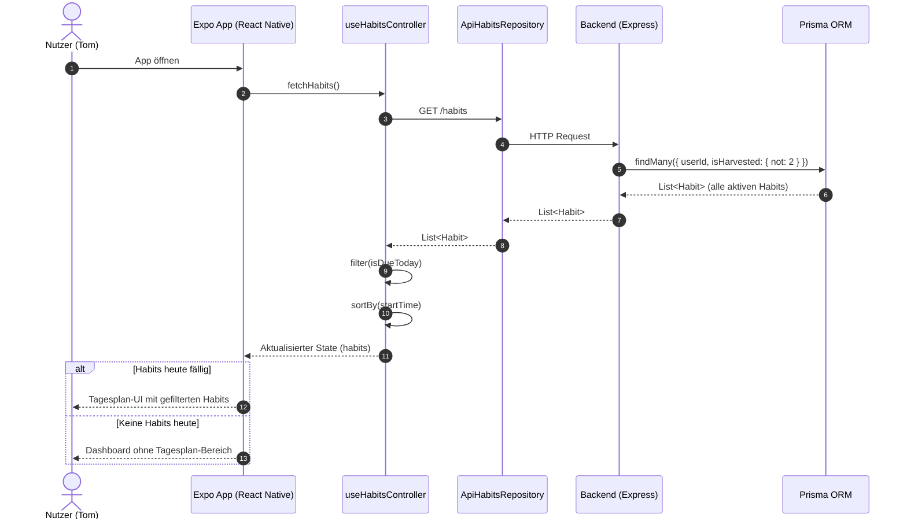

```mermaid
sequenceDiagram
    autonumber

    actor User as Nutzer (Tom)
    participant Expo as Expo App (React Native)
    participant FEHabit as useHabitsController
    participant ApiRepo as ApiHabitsRepository
    participant API as Backend (Express)
    participant Repo as Prisma ORM

    User->>Expo: App öffnen
    Expo->>FEHabit: fetchHabits()
    FEHabit->>ApiRepo: GET /habits
    ApiRepo->>API: HTTP Request

    API->>Repo: findMany({ userId, isHarvested: { not: 2 } })
    Repo-->>API: List<Habit> (alle aktiven Habits)
    API-->>ApiRepo: List<Habit>
    ApiRepo-->>FEHabit: List<Habit>
    
    FEHabit->>FEHabit: filter(isDueToday)
    FEHabit->>FEHabit: sortBy(startTime)

    FEHabit-->>Expo: Aktualisierter State (habits)

    alt Habits heute fällig
        Expo-->>User: Tagesplan-UI mit gefilterten Habits
    else Keine Habits heute
        Expo-->>User: Dashboard ohne Tagesplan-Bereich
    end
```