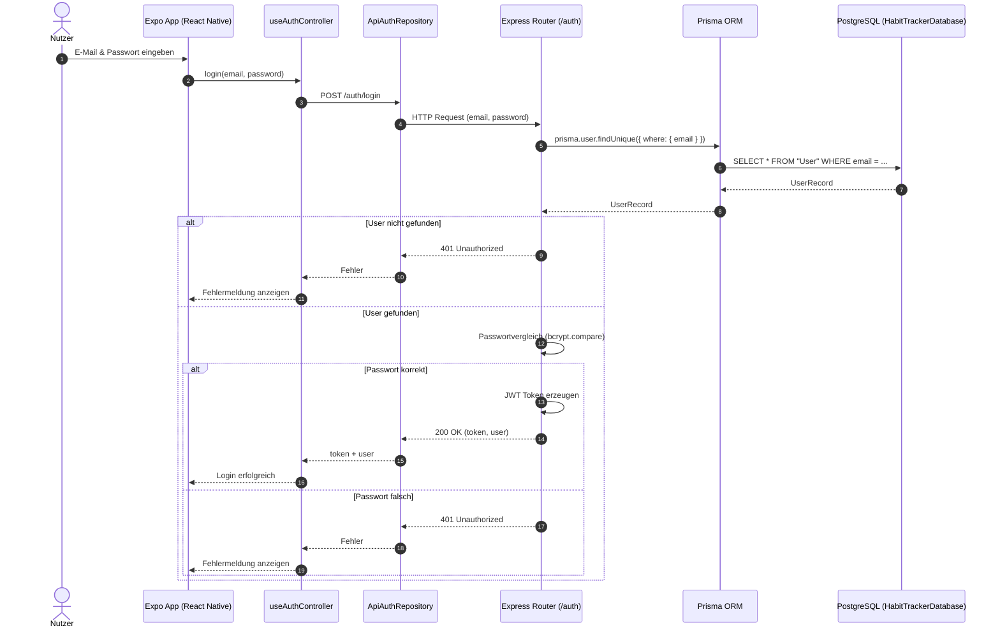
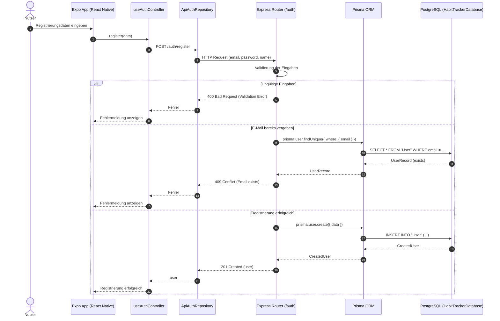
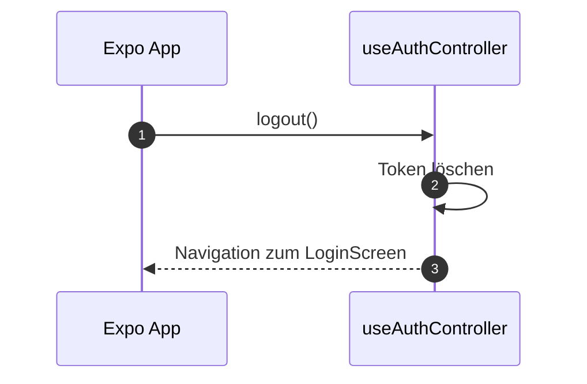
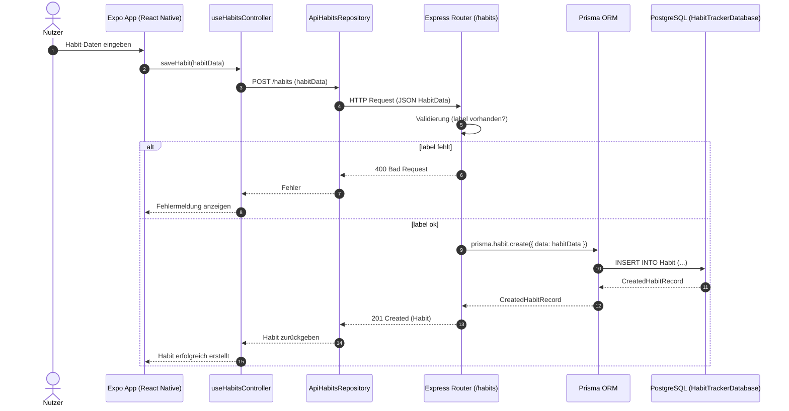
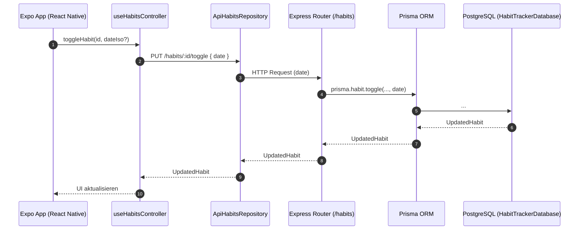

# Habitree – Sequenzdiagramme zu den wichtigsten User Stories

## Inhaltsverzeichnis
- [1. Login (US #250)](#1-login-us-250)
- [2. Registrierung (US #250)](#2-registrierung-us-250)
- [3. Logout (US #250)](#3-logout-us-250)
- [4. Habit erstellen (US #92/ US #279 / US #280)](#4-habit-erstellen-us-92-us-279--us-280)
- [5. Habit abhaken (US #93/ US #299)](#5-habit-abhaken-us-93-us-299)
- [6. Habit-Liste abrufen (US #93)](#6-habit-liste-abrufen-us-93)


## 1. Login (US #250)

**User Story**  
Als Nutzer möchte ich mich anmelden können, um Zugriff auf meine persönlichen Habits zu erhalten.




## 2. Registrierung (US #250)

**User Story**  
Als neuer Nutzer möchte ich ein Konto erstellen können, um die App nutzen zu können.




## 3. Logout (US #250)

**User Story**  
Als Nutzer möchte ich mich ausloggen können, um mein Konto zu schützen.




## 4. Habit erstellen (US #92/ US #279 / US #280)

**User Story**  
Als Nutzer möchte ich ein neues Habit erstellen können, damit ich meine Ziele strukturiert planen kann.




## 5. Habit abhaken (US #93/ US #299)

**User Story**  
Als Nutzer möchte ich ein Habit abhaken können, um meinen täglichen Fortschritt zu dokumentieren.




## 6. Habit-Liste abrufen (US #93)

**User Story**  
Als Nutzer möchte ich eine Übersicht meiner Habits sehen können, um meinen Fortschritt zu verfolgen.

```mermaid
sequenceDiagram
    autonumber
    participant Expo as Expo App (React Native)
    participant FEHabit as useHabitsController
    participant ApiRepo as ApiHabitsRepository
    participant Express as Express Router (/habits)
    participant Prisma as Prisma ORM
    participant PG as PostgreSQL (HabitTrackerDatabase)

    Expo->>FEHabit: fetchHabits()
    FEHabit->>ApiRepo: GET /habits
    ApiRepo->>Express: HTTP Request
    Express->>Prisma: prisma.habit.findMany()
    Prisma->>PG: SELECT * FROM "Habit"
    PG-->>Prisma: HabitList
    Prisma-->>Express: HabitList
    Express-->>ApiRepo: HabitList
    ApiRepo-->>FEHabit: HabitList
    FEHabit-->>Expo: HabitList anzeigen
